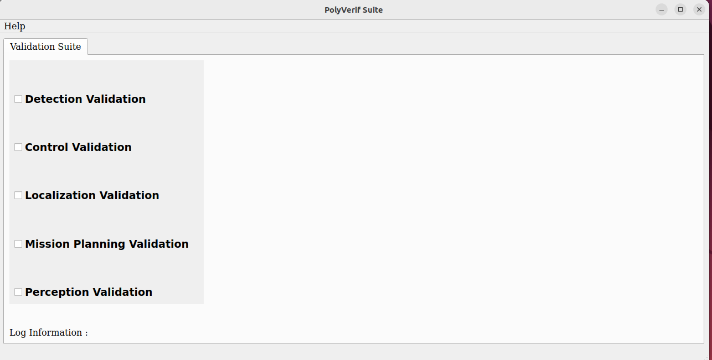

# PolyVerif User Guide Manual
This document aims to explain the process of using PolyVerif, from installing the 
necessary dependencies to how to use the software. It is important to note 
that the Acclivis team is constantly making changes to the software and that this document 
may not always be updated or true in some cases. Please be sure to check the 
PolyVerif's [Github](https://github.com/MaheshM99/PolyVerif/tree/PolyVerif-OSSDC-SIM)
at branch **PolyVerif-OSSDC-SIM** for the most updated changes. 

## Description

PolyVerif is a software that aims to generate test cases and validate 
some of the autonomous actions. In short its aim is to make it easier to study 
certain behaviors of an autonomous vehicle. It supports Scenic scenarios
description language with AutowareAuto to run specific scenarios, such as crashing,
following, and a few other. PolyVerif also uses a simulator environment known 
as OSSDC Simulator. This simulator is the UI of all scenes where the program 
will run and show scenes. 

## Installation

Needless to say this software is not an easy piece to run, there are a lot of 
dependencies which will be covered in later sections. Regardless of the 
dependencies, is also important to know some required PC specs that will 
help the software run with no problem. Is highly advised by the PolyVerif team 
that this specs are met for the best experience.

#### Hardware Requirements
    Operating System:
        Ubuntu: 18.04 or 20.04
    
    CPU:
        Intel i7 10700 or something similar in power

    GPU: 
        Nvidia RTX 2070(Minimum)

    RAM:
        8GB, better if its 16GB

The specs above are the required specs that PolyVerif asks in their Github. 
One that can't hurt to also have is using an **SSD** memory system rather than 
an **HDD**. 

If the above requirements are met then let's start with the dependencies installation.
Try to keep up!

#### Pre-Installation Requirements
To make the installation of dependencies easier please make sure the system 
has this installed.

    Python3.8
    Nodejs 12.16 

**IMPORTANT** Through the whole installation process make sure you, as a user have
root privileges, meaning you are able to use *sudo*.

There will also be script files, *.sh*. This files make it easier to run multiple 
commands at once. Some were given by PolyVerif and others were made by me to 
make installation easier. To run this type of files we first need to give the 
file exectuable privileges. This is done by doing the following. 

    chmod +x file.sh

Where file correspond to the name of the script file you trying to run. After 
that all there is to do is running the file by calling the file name with the 
*./*, something like this. 

    ./file.sh

#### Docker Installation
We will first install docker, the installation should be pretty straight forward.
I will be using the same guide PolyVerif offers in their github, inside the 
**Document** folder. 

The following linux commands of the installation can all be skipped if one runs
the *docker_installation.sh* file found in this repo. This scrip file should 
make it easier to install many dependencies and will be used through most of the 
installation process. Regardless, I will still show the commands.

Make sure when running this commands the system is at the $HOME directory. 
If you are not sure you can do 
    
    cd ~

This command will put you into the home directory, you can use *pwd* to make sure. 

**IMPORTANT** To prevent any errors from happening, make sure that everything 
is ran in a bash terminal. 

    $sudo apt-get update

    $sudo apt-get install \
        ca-certificates \
        curl \
        gnupg \
        lsb-release
    
    $sudo mkdir -p /etc/apt/keyrings
    
    $curl -fsSL https://download.docker.com/linux/ubuntu/gpg | sudo gpg --dearmor -o /etc/apt/keyrings/docker.gpg
    
    $echo \
      "deb [arch=$(dpkg --print-architecture) signed-by=/etc/apt/keyrings/docker.gpg] https://download.docker.com/linux/ubuntu \
      $(lsb_release -cs) stable" | sudo tee /etc/apt/sources.list.d/docker.list > /dev/null
    
    $sudo apt-get update
    $sudo apt-get install docker-ce docker-ce-cli containerd.io docker-compose-plugin

The above commands should properly install docker into your system. You 
may have to reboot your system for the dependencies to sync in within the system.

##### Nvidia Docker 
The PolyVerif uses docker as part of running the simulation, but we need to 
tell docker to use our graphics card. For that we will install **nvidia-docker**.

You can run the commands below or run the script file *nvidia_docker.sh* 

    $sudo apt install curl
    $distribution=$(. /etc/os-release;echo $ID$VERSION_ID)
    $curl -s -L https://nvidia.github.io/nvidia-docker/gpgkey | sudo apt-key add -
    $curl -s -L https://nvidia.github.io/nvidia-docker/$distribution/nvidia-docker.list | sudo tee /etc/apt/sources.list.d/nvidia-docker.list
    
    $sudo apt-get update && sudo apt-get install -y nvidia-container-toolkit
    $sudo systemctl restart docker

It is recommended to reboot one's system to let all of this dependencies sync 
into the system.

##### Extra Notes
If at any moment an error is received in the installation you can follow other 
guides to install the above mention dependencies. That said one should not find
any errors with the installation if all of the proper procedures were taken. 

Make sure docker is running in your system, to check if it is run the following 
command. 

    $sudo systemctl status docker

The output should an **Active** section and the 
desired result should be **active (running)**. If this is not the case 
you may have to configure docker to start on boot. Don't worry I got you cover. 

    $sudo systemctl enable docker.service
    $sudo systemctl enable containerd.service
    $sudo systemctl daemon-reload
    $sudo systemctl restart docker.service

If docker still does not work after all of this, external help may be needed. 

#### Installing PolyVerif Software 

Unlike previous sections, this section will not show any commands of installation. 
It is a lot of commands that were all compressed into two *.sh* files. 
All commands were tested and are good to go with minimum errors. 

There are known errors that may happen but they are small enough to not matter,
and won't stop the installation process. **MAKE** sure all the previous dependencies
are installed before proceeding with this installation. 

To begin please make sure to download polyverif_install.sh and polyverif_build.sh files from this 
repo inside the PolyVerifInstall folder. 

Move this to script files to the home directory and make sure to make them executable.

1. Run the **polyverif_install.sh** first.

After running the install script it will take a bit for all dependencies to install 
properly. Make sure to pay attention to the terminal for any input needed from 
user. As specified before, there may be a few errors, warnings but as long as the 
installation does not break then it will mean is ok. 

One of this expected errors is 
> PermissionError: [Errno 13] Permission denied: '/usr/local/bin/ade'

This error has to do with a movement privilege of a file, but it seems not 
to mess with the installation nor the running of the software.

If all goes well proceed to step 2.

2. Run the **polyverif_build.sh** file

This will probably take longer then the first script file as is the one that 
builds all dependencies. 

Errors you may see:

>Error response from daemon: failed to create shim task: OCI runtime create failed: runc create failed: unable to start container process: error during container init: error running hook #0: error running hook: exit status 1, stdout: , stderr: Auto-detected mode as 'legacy'

>CMake Error: The current CMakeCache.txt directory ~/avp_demo/build/avp_demo/CMakeCache.txt is different than the directory /home/acclivis/avp_demo/build/avp_demo where CMakeCache.txt was created. This may result in binaries being created in the wrong place. If you are not sure, reedit the CMakeCache.txt
CMake Error: The source directory "/home/acclivis/avp_demo" does not exist.

The first error can mean that the installation of docker and nvidia-docker failed. 
Or that it cannot be found. I recommend to first reboot the system and update 
the repositories of the system with ***sudo apt update*** if you already installed
nvidia-docker. If this does not work then you may research about how to properly 
install it. I do also recommend to make sure your Nvidia drivers are up to date. 

Second error is still unkown if its a big deal. Having this error will not cause 
any problems within the installation.

If everything goes well you should now have a new folder within your home directory.
This folder should be **"adehome"**. If not sure try to move into the directoy by 
**cd ~/adehome/** If this fails it means something went wrong with the installation. 

#### Installing The Simulator

Please only do this step if the previous installs were successful.

As mentioned before the PolyVerif software uses a simulator by the name of 
OSSDC. We have already installed the big dependencies, this is not as hard 
as the previous ones.
 
To get started you first have to download the OSSDC folder found in [this link](https://drive.google.com/uc?export=download&id=1sPAOsk_AwnXgeW9QW3aTJPa3TjmjDNWl).

Make sure to extract the content of the zip to get a folder by the name of 
**OSSDC-SIM-V1_1-Linux**. If this is not the extracted content then open the 
extracted content as it may be inside. If this folder is still not found then 
the download of the zip folder went wrong somewhere. So make sure to download it
once again.

If not sure how to unzip you can use the command line, like this. 

Once the **OSSDC-SIM-V1_1-Linux** folder has been identified we will move it to 
the **adehome** directory. I will show you the command to move folders but you 
can do it by using the File Manager UI. 

    unzip ~/Downloads/downloadOSSDC-SIM-v1_1-Linux.zip ~/adehome/ 

The command shown above does all 2 things in one. It extracts the content from 
the zip folder and moves it straight to the **adehome** directory.

Now all there is left to do is going into the **OSSDC-SIM-V1_1-Linux** folder and 
make two files executables. Run the following command to make this happen.

    sudo chmod +x ~/adehome/OSSDC-SIM-v1_1-Linux/run-OSSDC-SIM-v1.sh ~/adehome/OSSDC-SIM-v1_1-Linux/OSSDC-SIM

This command will make the files specified executable.

If you run into an issue it may be better to open **OSSDC-SIM-V1_1-Linux** directory
first and then run the same command but without the paths. Something like this. 

    sudo chmod +x run-OSSDC-SIM-v1.sh OSSDC-SIM

#### Next

Now you should have all the proper dependencies installed and everything should be good
to go. To run the PolyVerif software you will have to use the terminal run the following commands.

    cd ~/adehome/PolyVerif/

    ./polyVerif 

Let it run and build and you should be greeted with this window.

This is where the magic happens. To know what everything does and how to run scenes please
check the **PolyVerif_Usage_Guide.md** to a run-through on what everything does. 

Enjoy!!

#### Contact

If any issues happen you can go ahead and make an Issue within this same github,
or contact me directly at hernanw4@my.erau.edu. 

Or the main professor Dr. Akbas at akbasm@erau.edu.

