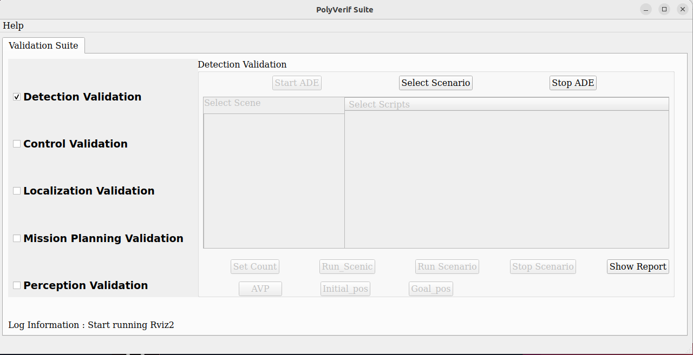
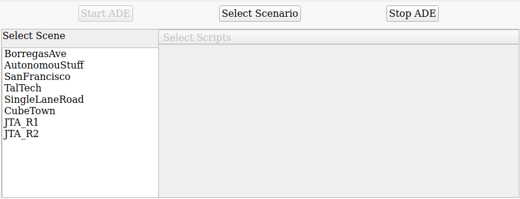
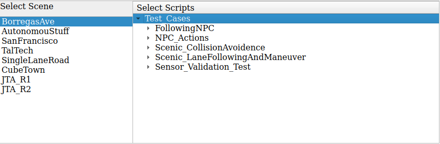
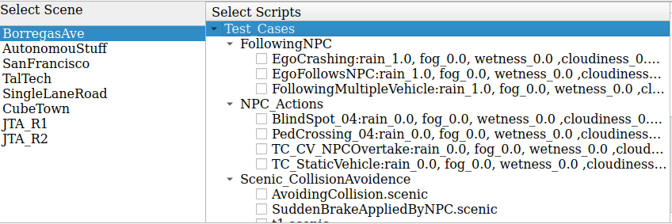
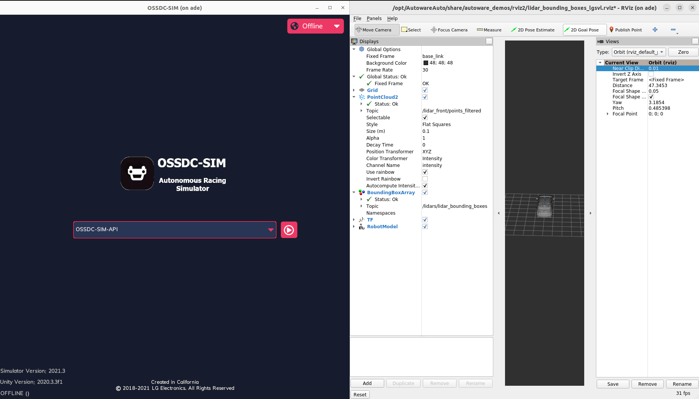

# User Guide
This document servers as a guide on how to properly use the PolyVerif 
software. This document does not talk about installation or download, for that 
please check the proper document. That said, it is assumed that PolyVerif 
was successfully installed with no errors. I will be speaking about a 
few errors may encounter as well. 

## Starting PolyVerif 
To start PolyVerif please make sure to go into the **adehome/Poly_Suite** directory
in your terminal and run **./polyVerif**. Give it a minute and a window should pop 
up looking like this.

This is the main window, here the user can't do much other then selecting 
a type of validation and start the software. 

## Scene Setup
The next step is to choose a validation and an button will appear at the right 
that should say **Start ADE**. The user will press this and wait for a few seconds,
or minutes. After the wait 2 more windows should appear as well. I will go more 
in detail in a bit but let's first see how our main window has changed. 

After starting the ADE the white space in the main window should have a bit 
more of content now. Something like this. 

If you have this window that means everything so far has gone well, good job! Now
let me walk you through on what the button **Select Scenario** means.

### OSSDC Simulator, Rviz, and Scenarios
When the user presses the **Select Scenario** button, the *Select Scene* panel
should show more options. Now this options amount differs according to the 
**Validation** type you chose, so keep that in mind.

This is how the *Select Scene* panel would look like if you select the **Detection
Validation**.

Now we are able to select a scene, this are the only scenes as of right now. 
Some are actual streets in cities and are very detailed. 

There are a few scenes that may not work sometimes, or just not work at all.
This scenes are 
1. TalTech
2. JTA_R1
3. SanFrancisco
> SanFrancisco for the most part works, but scenes within ScanFrancisco may 
sometimes not work. 

#### Select a Scene
Now let's go ahead and select a scene we would like to run. For this document 
I will be choosing the **BorregasAve** scene. Doing this the panel to the right
should display a few more options organized.

You will see a **Test Cases** drop down, this are the test cases the PolyVerif 
team has made. Most of this tests work, with only a few exceptions here and there. 
As we can see there are quite a few options to choose from for the test cases. 

**FollowingNPC** are cases where the tested vehicle attempts to follow an 
NPC vehicle. 

**NPC_Actions** cases where NPCs do some kind of actions, like a pedestrian 
crossing the street, or NPC vehicles moving to blindspots.

**Scenic_CollisionAvoidence** multiple scenes where specific events are meant 
to happen. This is done to simulate scenarios to see how the vehicle may react.
In this case, this scenes will try to avoid collision between another cars. 

**Scenic_LaneFollowingAndManeuver** same case as the previous but different 
events are tested. For example this scenes are for following lanes and maneuvering.

**Sensor_Validation_Test** Still under development, does not work.

>The Scenic scenes are specific scenes that are read from specific files. That
use the language descriptor scenic. I won't be going over how does it work so 
if you want to know more about scenic is advised to do own research.

**IMPORTANT** The above mentioned test cases are ran differently. By this I mean 
that once a test case is select, there will be a few buttons on the bottom. 
The **Run Scenic** is meant to run only **Scenic** type test cases, and the 
**Run Scenario** for all others.

The following image shows most of the test cases corresponding to BorregasAve.

Before running the scenes check the next sub-section.

#### OSSDC and RVIZ
Now, before you choose your test case and hit the **Run Scenario/or Scenic** button
there is one extra step.

Remember the 2 other windows that appear after starting ADE?  They should look 
like this.

The left window, OSSDC Simulator, corresponds to the simulator where the scenes will run on. 
**BEFORE** running the scenes you have to make sure the play button is pressed.
This will start the simulator API that PolyVerif will use to connect and send 
the appropiate data to start. This **MUST** be done before running any scenes, 
or it will cause errors and not run properly. 

The window on the right, Rviz, shows the vehicle and its environment and sensors. At 
the beginning it doesn't show as much because the simulation is not running. 
Once a simulation start, the window will start showing the sensors, and any 
obstacles the vehicle detects around. You don't have to do anything in this 
window, but you are welcome to play with it and test things out.

**ALL** set, you now have the necessary to start any scenes. Go ahead and give it
a try. Check the **Error** sections for knowing errors that may happen during 
the run scenes. Or submit a pull request or issue and I will try to help.

## Errors
As of now there are quite a few bugs one may find using the PolyVerif software,
this is to be expected as the software is still under development. That said,
there are few errors that may restrict the simulator from running. 

The errors I will be mentioning will appear in one of the terminals that will
appear once a simulation is started.

A known error that happens sometimes is the 
>assets not found

This error means that there are a few problems with the network bandwith.
The only ways to fix such error is to make sure that your network connection 
is stable, and that you are not overflowing with traffic. Sometimes you may 
have to reboot the computer as well. If nothing works, then the other option 
is to wait until your network gets cleared. 

>Moved permantly

This error will happen from time to time, but its quite easy to fix sometimes. 
The message will appear most of times due to some error happening when 
trying to run a new scene in top of another one, which is possible. It doesn't
mean you can't just run a new scene if you already finished another one, but 
sometimes it bugs out and it doesn't run either. The best way to fix this is to 
stop the OSSDC simulator and start it back up. Or, to hit the button **Stop ADE**
at the top right of the PolyVerif software and start it back up.

One may find a few more bugs or errors, you are welcome to contact me or 
Dr. Akbas about it and we would include it in this forum. Sometimes
errors, or bugs will require you to go into the source code and fix a few 
python related errors. The source code for every test case 
can be found under the **Test_Cases** folder in the **adehome** directory. In 
that directory you will find all test cases and the code for each.

